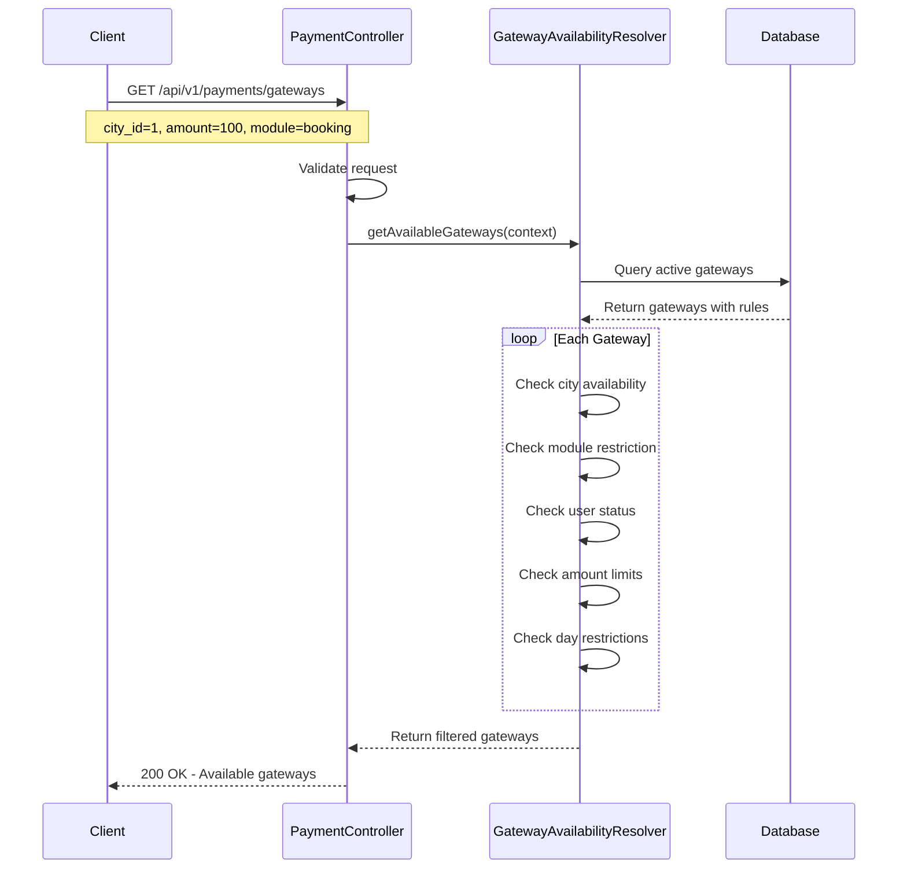
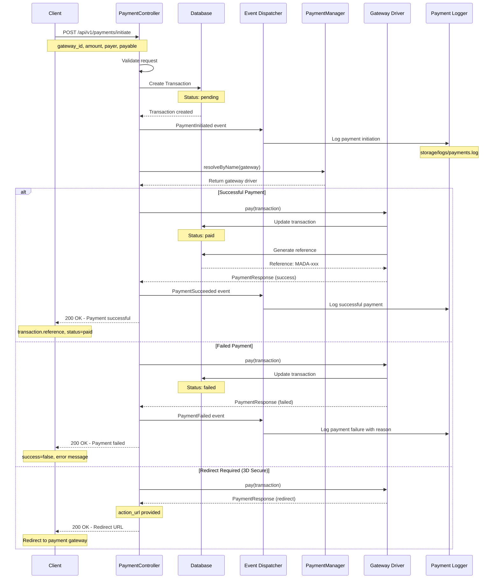
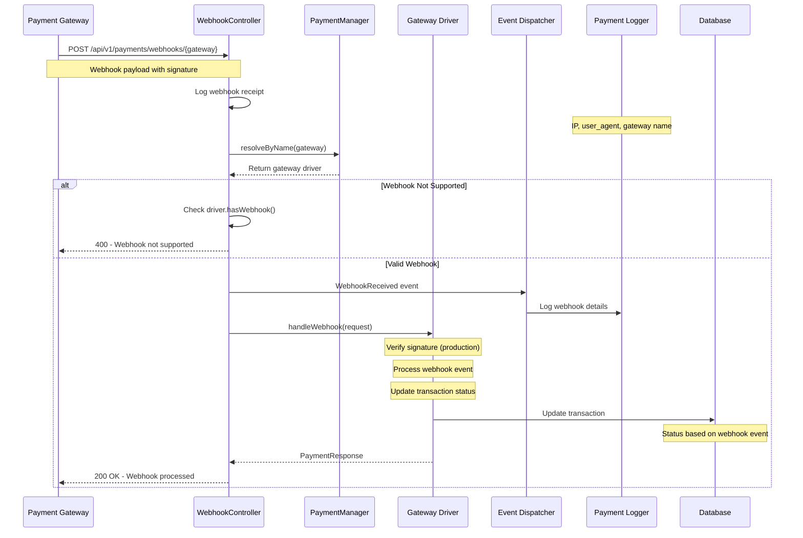
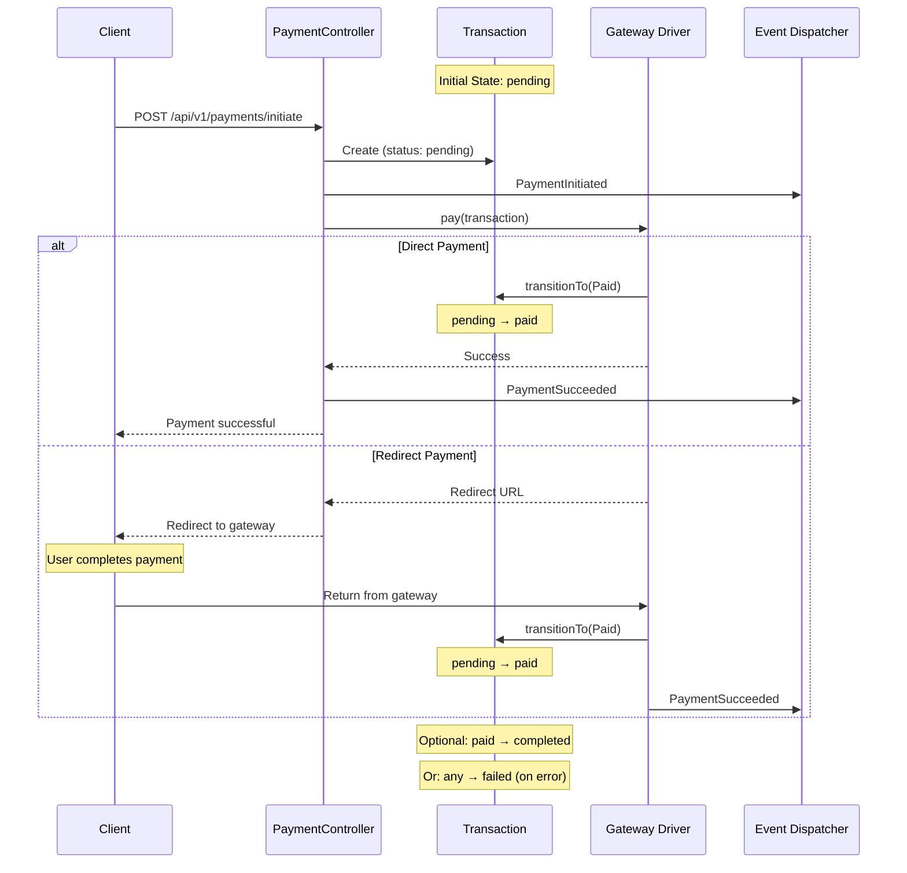

# Payment Flow Sequence Diagram

## 1. Gateway Availability Check



## 2. Payment Initiation Flow



## 3. Webhook Processing Flow



## 4. Complete Payment Lifecycle (with States)



## Architecture Components

### Event-Driven Flow

```
PaymentInitiated → LogPaymentInitiated
    ↓
Payment Processing
    ↓
PaymentSucceeded → LogPaymentSucceeded
    OR
PaymentFailed → LogPaymentFailed
    ↓
PaymentCompleted → LogPaymentCompleted (optional)
```

### State Machine Transitions

```
[pending] ──→ [processing] ──→ [paid] ──→ [completed]
   │              │               │
   │              │               └──→ [failed]
   │              │
   │              └──→ [failed]
   │
   └──→ [failed]
```

### Gateway Availability Rules

```
Gateway Active?
    ↓ YES
City Match? (if restricted)
    ↓ YES
Module Match? (if restricted)
    ↓ YES
User Status Match? (if required)
    ↓ YES
Amount ≥ Minimum? (if set)
    ↓ YES
Day Allowed? (if restricted)
    ↓ YES
Available ✓
```

## Key Design Decisions

1. **Event-Driven Architecture**: Decouples payment processing from side effects (logging, notifications)
2. **Manager Pattern**: Easy to add new gateway drivers without modifying existing code
3. **State Machine**: Prevents invalid state transitions, clear lifecycle
4. **DTO Pattern**: Type-safe data transfer, self-documenting
5. **Dedicated Logging**: Separate payment logs for audit trail and debugging
6. **Webhook Support**: Async payment confirmation from gateways
7. **Config-Driven Rules**: Gateway availability based on database rules, not hardcoded
